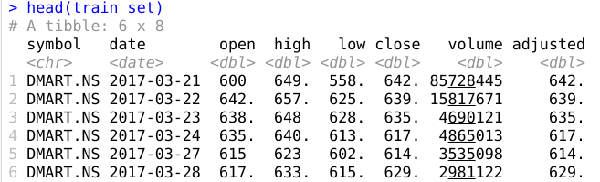
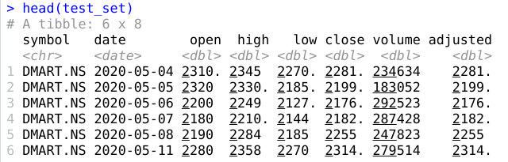
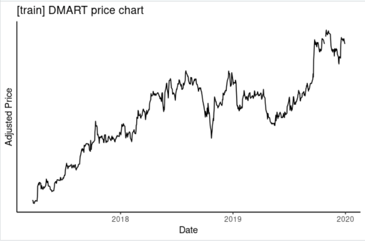
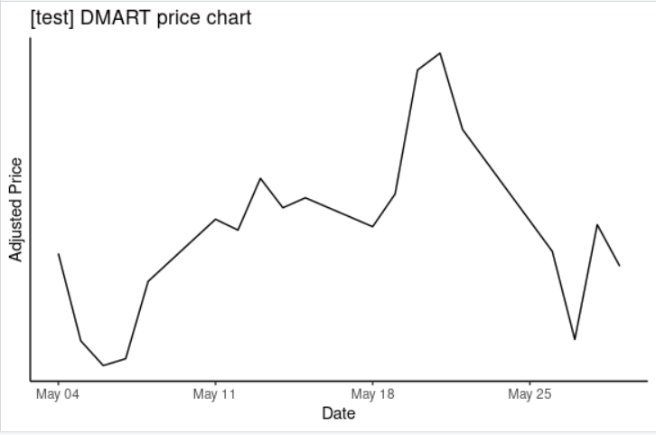
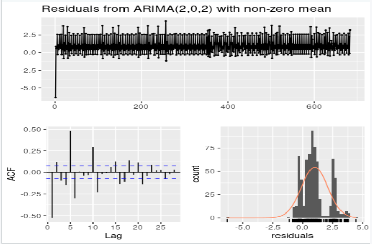
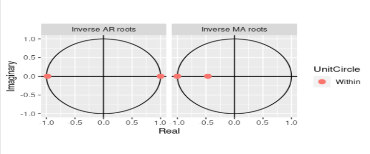
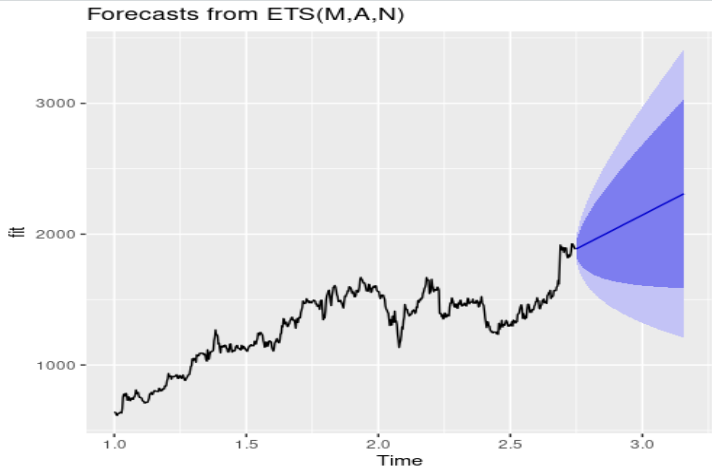
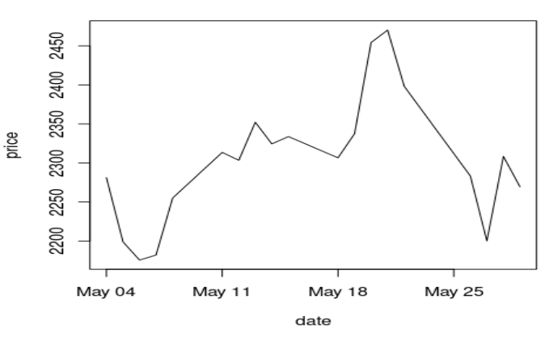

# Time series forecasting for NSE:DMART

## Install and load required packages
```r
install.packages('tidyquant')
install.packages('fpp2', dependencies=TRUE)
library(tidyquant)
library(fpp2)
library(ggplot2)
```

## Fetch the data
```r
# Get training data
train_set = tq_get('DMART.NS', from='2014-01-01', to='2019-12-31', get='stock.prices')
test_set = tq_get('DMART.NS', from='2020-05-01', to='2020-05-31', get='stock.prices')
```

## View dataset
```r
head(train_set)
```


```r
head(test_set)
```


## Plot the datasets
```r
train_set %>%
  ggplot(aes(x = date, y = adjusted)) +
  geom_line() +
  theme_classic() +
  labs(x = 'Date',
       y = "Adjusted Price",
       title = "[train] DMART price chart") +
  scale_y_continuous(breaks = seq(0,300,10))
```

```r
test_set %>%
  ggplot(aes(x = date, y = adjusted)) +
  geom_line() +
  theme_classic() +
  labs(x = 'Date',
       y = "Adjusted Price",
       title = "[test] DMART price chart") +
  scale_y_continuous(breaks = seq(0,300,10))
```


## Identify the parameters for the ARIMA model
We are using order 2
```r
train_cleaned = subset(train_set, select = -c(close, high, low, open, symbol, volume))
(fit <- data=train_cleaned	)
```


## Plot of Fit
```r
autoplot(fit)
```


## Forecast of Fit for the next 150 days (includes May 2020)
```r
autoplot(forecast(fit, h=150))
```


Plot of test data


## Conclusion
Forecast of fit shows that the price of NSE:DMART potentially lies approximately between 1600 and 3000. Throughout the test period it can be seen that the price lies between 2100 and 2500, which is a subset of 1600-3000. 


